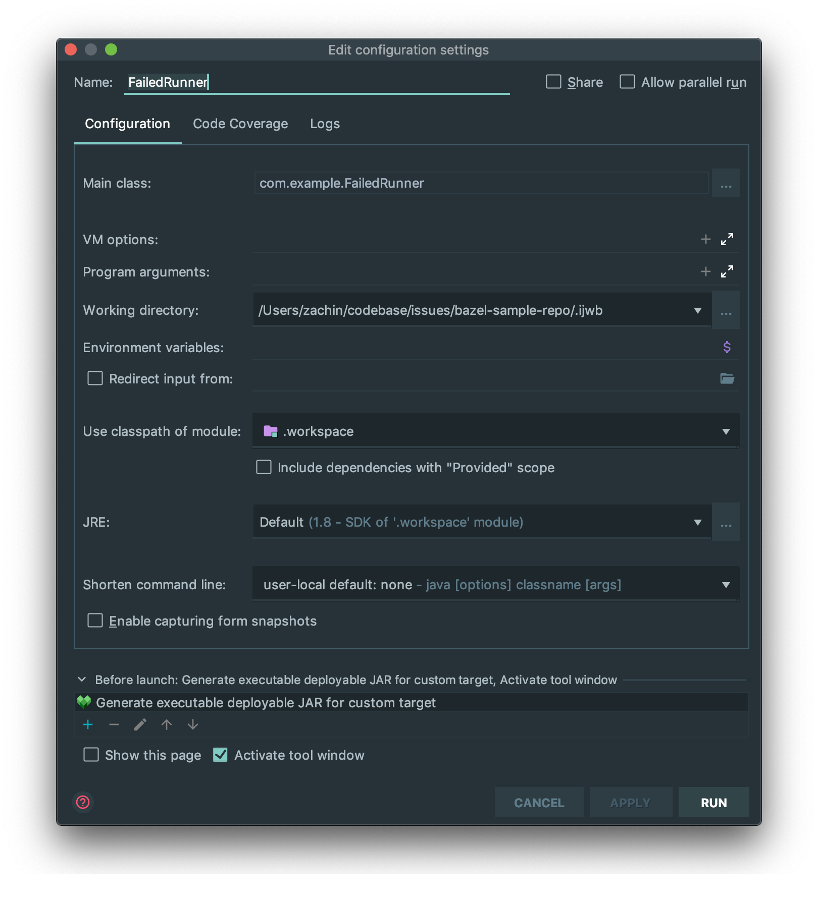

## Issue Overview 

**What happened**: 
Intellij runner is not properly populated with VM options which results in a `Failed to find a deployable jar when building ...` error. 
 

**What you expected to happen**: 
Runner should get populated with required deployables and application should run successfully.

**How to reproduce it (as minimally and precisely as possible)**: 
1. Import repo as a Bazel project
2. Setup runner configuration as follows:
 

**Anything else need to know?**: 
None.

**Environment**: 
- OS: macOS Mojave `10.14.6` 
- Bazel (Wix Fork): `v2191.08.23.0.3.108-WIX`
- Bazel Wixperiments: `v0.1.92`
- Scala version: `2.13.0`

**Logs**: 
None.
